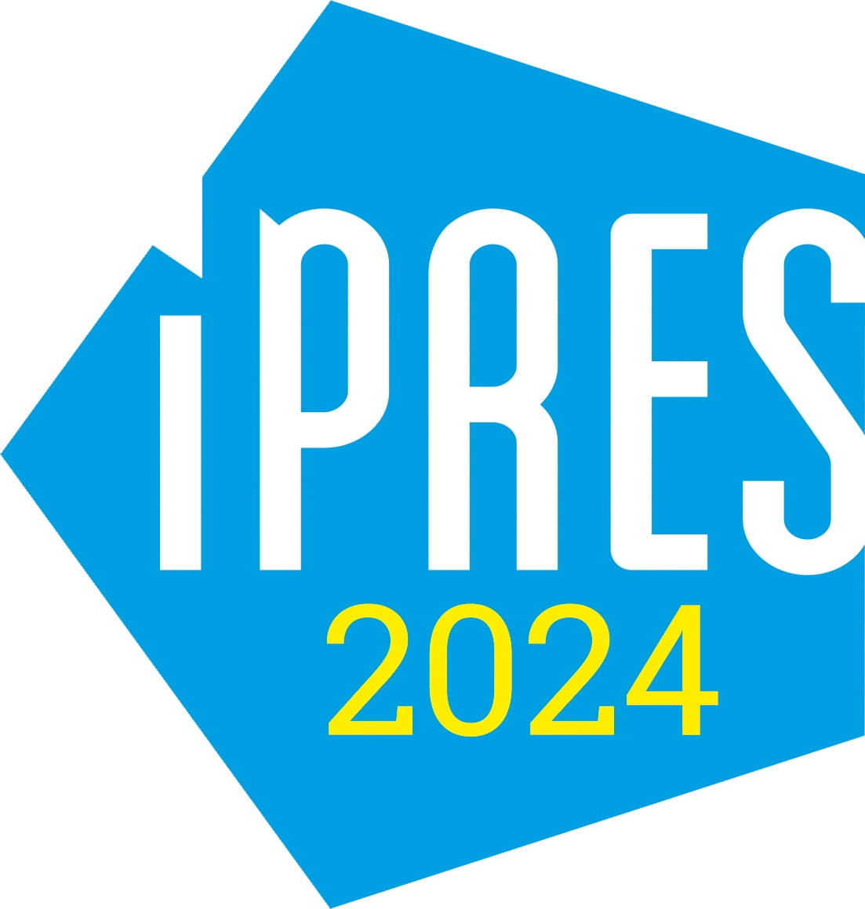

### How Preservable is your Complex Digital Project? Introducing a Self Assessment Tool

Join us at 14:00 on September 16, 2024!

We invite you to experiment with a new Self Assessment Tool that identifies preservability risk factors for complex works and offers recommendations to content creators that could improve your project’s preservation outlook.

This 2-hour workshop is designed for anyone preserving complex works (or interested in doing so) that may need to assess their preservability. It is especially relevant to those who interface with content creators and have opportunities to give feedback to improve preservation outcomes – for example, those working with digital humanities researchers.

We are excited to share our work and to provide an opportunity for attendees to experiment with this new tool that is a result of five years of research into the preservability of new forms of scholarship!

[Register for iPres2024](https://ipres2024.pubpub.org/registration) and [our workshop](https://ipres2024.pubpub.org/pub/ij2bsrgo/release/1?readingCollection=ef524688) today. 

[Download the abstract to learn more](https://wp.nyu.edu/embedding_preservability/wp-content/uploads/sites/24603/2024/06/80191f45-fac7-46b6-aa0b-8b3d373ba499.docx).

