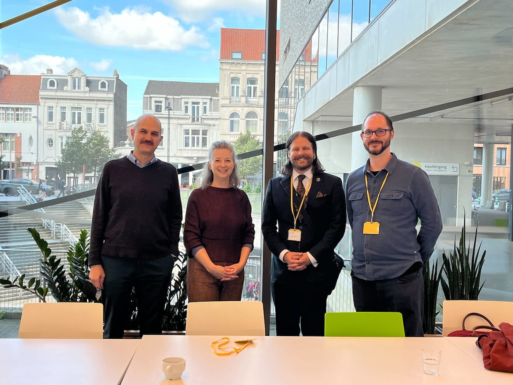
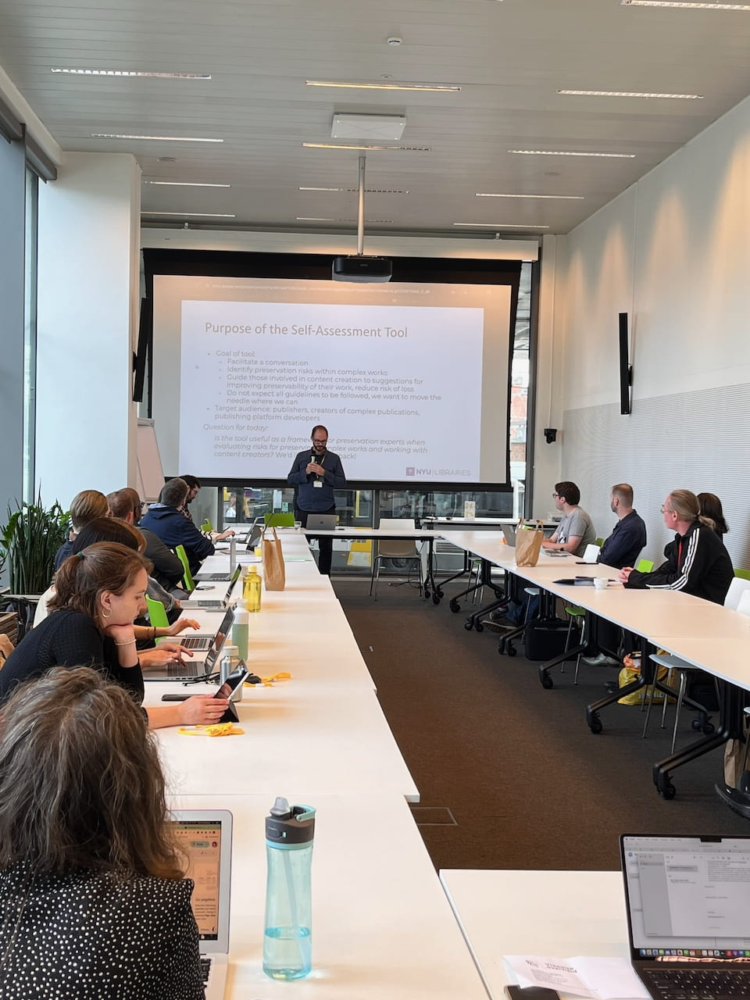
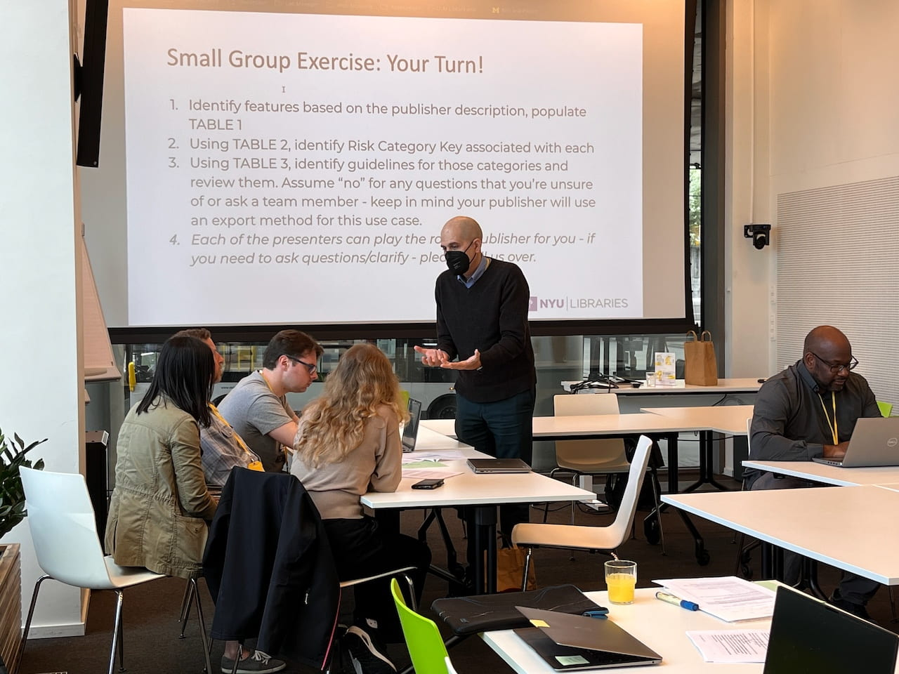
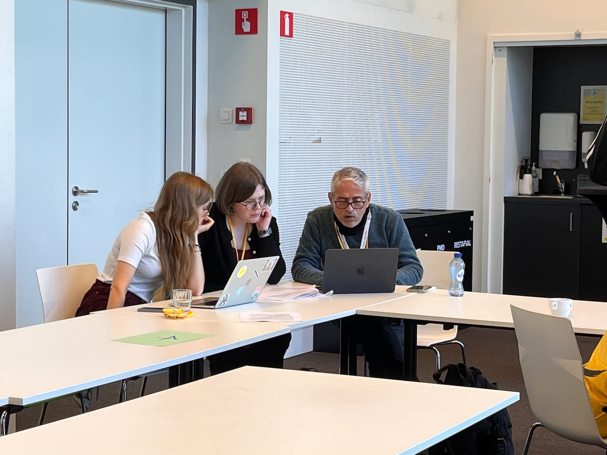
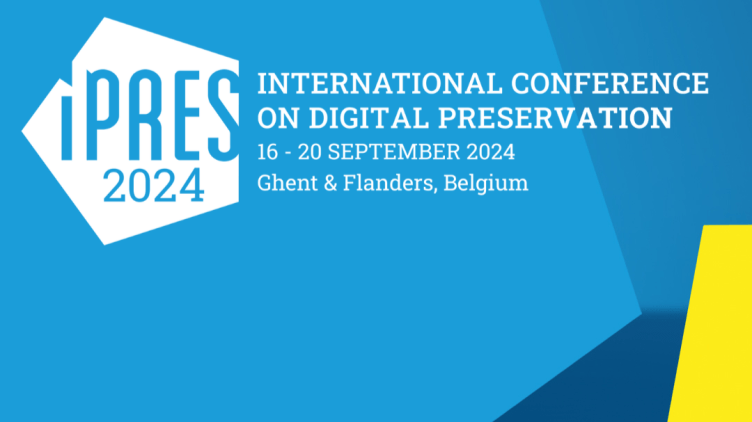

## Introducing a Self-Assessment Tool

Embedding Team members Jonathan Greenberg, Angela Spinazzè, Thib Guicherd-Callin, and Scott Witmer traveled to Ghent, Belgium to participate in iPRES2024 where they facilitated a workshop that introduced a draft version of a Self-Assessment tool that is being developed as an additional deliverable of this research.

The tool is a response to a need identified by publisher and platform project partners. The embedding process revealed that they were willing to take some action towards improving preservability earlier in the production process. However, due to the overwhelming nature of the Guidelines in their current form, they needed the embedding team’s assistance in order to effectively do so. As a result, the design of the Self-Assessment tool is based on the embedding process. It is grounded in a series of conversations intended for project team members, authors, engineers, software developers, and other allies to engage in over time.

The purpose of the tool is threefold:

1. Identify preservation risks within complex works

2. Guide those involved in content creation towards suggestions for improving preservability of their work

3. Reduce the risk of loss

At iPRES2024, the goal was to both introduce the tool to potential new users and to learn from experts in the field of digital preservation how useful a tool such as this would be for them in their work environments. Participants represented a broad range of organizations such as national preservation networks, university libraries, and service providers as well as roles including digital collection archivists, software preservation technologists, project managers, researchers, digital archiving engineers, digital preservation archivists and librarians.

This is the second workshop where a draft version of the tool has been introduced. It is being updated after each experience. We anticipate an official launch in early 2025.

