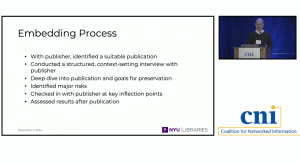

On December 9th, Jonathan Greenberg, Digital Scholarly Publishing Specialist at NYU presented a lightening talk, titled “A Tool for Assessing the Preservability of Complex Digital Publications” that introduced participants to the new Self-Assessment Tool that we have been developing and work-shopping over the past year.

Listen to his talk [HE](https://www.cni.org/topics/digital-preservation/a-tool-for-assessing-the-preservability-of-complex-digital-publications-lightning-round)[RE](https://www.cni.org/topics/digital-preservation/a-tool-for-assessing-the-preservability-of-complex-digital-publications-lightning-round).

*Abstract: **Embedding Preservability for New Forms of Scholarship** is the second project led by New York University (NYU) Libraries and funded by the Mellon Foundation to explore ways to improve the preservation of complex, non-traditional forms of digital publication. After three years embedding in publisher workflows for digital publications, providing guidance on features with preservability risks and how to address them, embedded team members from NYU Libraries, Portico, the LOCKSS Archive, and the University of Michigan Libraries have created a self-assessment tool that allows publishers, platform developers, and other content creators to analyze works and platforms to identify risks to long-term preservation. The tool, which has been tested over the past year in workshops with publishers, librarians, and preservation specialists, works in combination with the set of 68 guidelines published during the previous project. Together, the self-assessment tool and the guidelines will allow organizations with a range of technical expertise to produce interactive, multimodal publications that can be preserved within the scholarly record. The tool and a revised version of the guidelines will be published in early 2025.*
