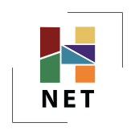

The Embedding Team wishes to thank Catherine Cocks and the editors at The H-Net Book Channel for the invitation to contribute a [guest post](https://networks.h-net.org/group/discussions/20062697/assessing-preservability-new-forms-scholarship) to officially introduce the updated [Guidelines for Preservability in New Forms of Scholarship](https://preservingnewforms.dlib.nyu.edu/) and the [Preservability Self-Assessment Tool](https://archive.nyu.edu/handle/2451/74902) on the scholarly communications blog [Feeding The Elephant](https://networks.h-net.org/feeding-the-elephant).

