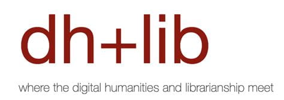
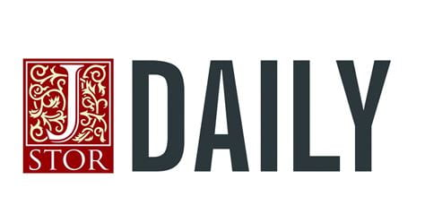

Thanks to [dh+lib](https://dhandlib.org/post-assessing-preservability-in-new-forms-of-scholarship/?utm_source=feedly&utm_medium=rss&utm_campaign=post-assessing-preservability-in-new-forms-of-scholarship) and [JSTOR Daily](https://daily.jstor.org/expanding-the-possibilities-for-preservability/) for spreading the news about our recently published [Guidelines for Preservability in New Forms of Scholarship](https://archive.nyu.edu/handle/2451/74901) and [Preservability Self-Assessment Tool](https://archive.nyu.edu/handle/2451/74902). We appreciate you!

