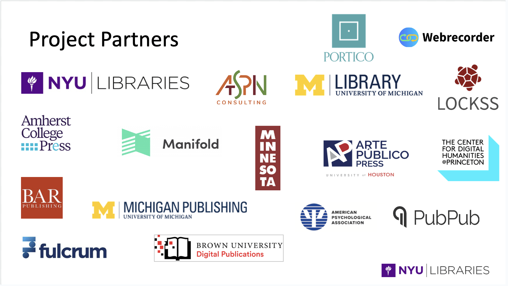

On June 13, 2025, the Embedding Team hosted a hybrid symposium at Bobst Library at NYU to mark the culmination of our multi-year project focused on advancing the preservability of complex digital scholarship.

The symposium presented highlights from our research, featured perspectives from publisher and platform partners and debuted the updated version of the[ Guidelines for Preservability in New Forms of Scholarship](https://archive.nyu.edu/handle/2451/63332). Also introduced was the [Preservability Self-Assessment](https://archive.nyu.edu/handle/2451/74902) — a practical tool designed to help others embed preservability into their own digital scholarly projects. Attendees heard from others in the field who are tackling the challenges preserving complex, multi-modal digital scholarship. Together, we explored the question at the heart of this work: How can we move the preservability of digital scholarship forward?

The morning sessions included a statement of findings presented by Jonathan Greenberg, NYU Libraries; publisher experiences shared by Sara Jo Cohen, University of Michigan Press and Allison Levy, Brown University Digital Projects; an overview of updates made to the Guidelines for Preservability in New Forms of Scholarship and a demonstration of the Preservability Self-Assessment by Karen Hanson, Portico.

The afternoon sessions were designed to broaden the conversation beyond the scope of the project and began with a set of presentations from colleagues whose work is focused in a similar direction including: Gareth Cole and Holly Turpin spoke about preservability in the context of theses and dissertations (COPIM WP7); Alicia Wise introduced community efforts now underway to develop an EPUB/A standard; Janelle Jenstad talked about her work with colleagues building sustainable digital humanities projects (The Endings Project); Ilya Kremer of Webrecorder shared a new community-facing effort to build custom behaviors for preservability for their tool set; Lydia Gregg brought the history of art in medicine to life from the drawings of the founder of the program at Johns Hopkins School of Medicine through to the present day curriculum and the technology integral to sustaining this work that students learn to use from day one; and Chris Durlacher shared his film-maker and co-author perspective through his work on The Preservation of Knowledge in the Digital Age report. Following the presentations, attendees worked in small groups to explore the possibilities, opportunities, and challenges in the field; and imagine how we might collectively move preservability forward.

## Summary of the small group breakouts

Participants were divided into five breakout groups, which were given three questions to consider, and were instructed to generate answers for at least one of them: What opportunities and possibilities do we see? What connections across initiatives can we make? And what challenges need to be addressed? Ideas were recorded by a notetaker in each group. We have extracted highlights below.

Participants identified challenges to preservability including the funding and time constraints for applying enhancements related to preservation. Lack of leverage to enforce preservation standards was identified as problematic, in contrast to the legal and institutional measures that incentivize accessibility. Other constraints include the need to have a wide variety of expertise (including technical) in the room in order to implement changes to improve preservability, and the challenge of educating publishers, platforms and researchers about preservability.

Participants saw opportunities to continue and strengthen the work done in Embedding Preservability for New Forms of Scholarship. One group highlighted that there is room for publishing platforms to enable better preservability—especially platforms not used by the publishers in Embedding Preservability. Groups talked about making the Self-Assessment Tool interactive, something the Embedding Team talked about but didn’t have time to do. Some participants felt there is a need for further publicity and exposure for the guidelines and Self Assessment Tool.

There were also broader suggestions for improved infrastructure, standards, and other initiatives. Multiple groups brought up the opportunity for a directory or a consortium that would further create community and shared services for preservability and would help publishers find preservation and technical expertise. There was also interest in creating a formal certification or approval structure for preservability that might give weight or incentives to publishers and other creators to invest in conformance. Participants acknowledged that codifying file formats such as EPUB/A and WACZ as standards would make it easier for many publishers and platform developers to ensure preservability. (What if a web archive file, either in WARC or WACZ format, were the publication format? one participant asked.) Participants also talked about expanding the effort toward preservability beyond scholarly publishers, perhaps through libraries (and their membership organizations).

Finally, symposium participants identified strategic approaches to make scholarship more preservable. Like accessibility-first software development, we could encourage preservability-first development of software and digital publications. Aligning with accessibility even more broadly might capitalize on existing standards and workflows. Participants also suggested embedding best practices for preservability in undergraduate and graduate education, perhaps in writing courses or in the publication of theses and dissertations.

We hope that some of these ideas gain traction.