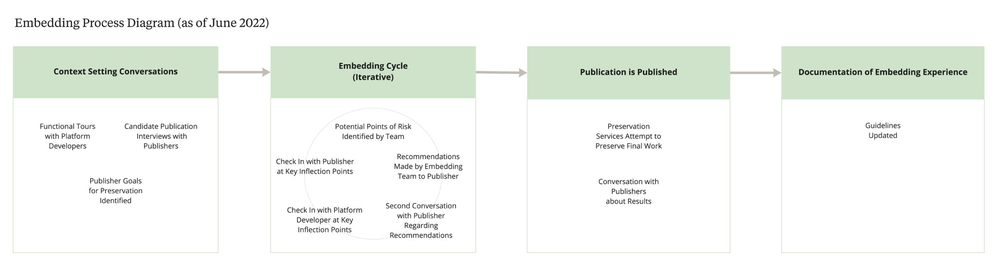

The process of embedding with publishers begins at the point a candidate publication is identified by the publisher. The embedding cycle is iterative and includes a set of conversations amongst the embedding team, the publisher, and the developers of the publication platform that take place at key inflection points leading up to and within the production timeline. The visual below provides a picture of what the process looked like as of June 2022. 

[figure caption="The visual above shows the four steps of the embedding process as of June 2022. The first step is setting the context. The second step is the iterative embedding cycle. The third step happens once the publication is published. And, the final step will be focused on updating the guidelines."]

[/figure]

## See also:

* [Project Updates](../news)
* [Embedding Team and Project Partners](../team)
* [Publications](../../../03.publications/)